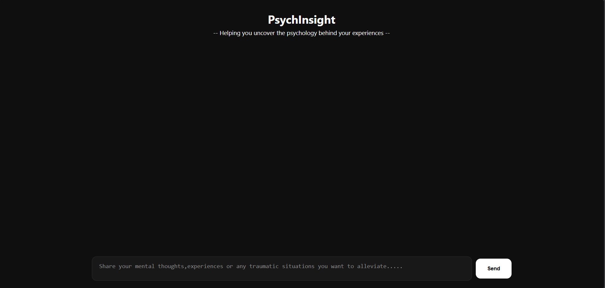

# 🧠 PsychInsight
## -- Helping You Uncover the Psychology Behind your Experiences --

PsychInsight is an AI-powered psychological insight assistant that helps users understand the psychology behind their experiences, thoughts, emotions, and behaviors.

Rather than providing diagnoses or medical advice, PsychInsight focuses on explaining psychological concepts, exploring possible interpretations, and encouraging deeper self-reflection through meaningful conversations.

---

## ✨ Features

- 💬 Conversational psychology assistant
- 🧠 Explains psychological concepts in simple language
- 🔍 Analyzes personal experiences from a psychological perspective
- ❓ Asks thoughtful follow-up questions
- 🚫 Does not provide diagnoses or medical advice
- 📚 Maintains short-term conversation context
- 🌐 Fully deployed web application

---

## 🛠 Tech Stack

### Frontend
- React
- Vite
- Axios
- CSS

### Backend
- FastAPI
- Uvicorn
- Google Gemini 2.5 Flash

### Deployment
- Vercel (Frontend)
- Render (Backend)

---

## 🚀 Live Demo

### Website
https://psychinsight-frontend.vercel.app/

### Backend API
https://psychinsight-backend.onrender.com

---

## 📸 Screenshots

   

---

## 📂 Project Structure

```text
PsychInsight
│
├── backend
│   ├── app.py
│   ├── prompts.py
│   └── requirements.txt
│
├── frontend
│   ├── src
│   ├── public
│   ├── package.json
│   └── vite.config.js
│
└── README.md
```

---

## ⚙️ Installation

### Clone Repository

```bash
git clone https://github.com/nitinallepker/PsychInsight.git
cd PsychInsight
```

### Backend Setup

```bash
cd backend

pip install -r requirements.txt
```

Create a `.env` file:

```env
GEMINI_API_KEY=YOUR_API_KEY
```

Run backend:

```bash
uvicorn app:app --reload
```

Backend runs on:

```text
http://127.0.0.1:8000
```

---

### Frontend Setup

```bash
cd frontend

npm install
npm run dev
```

Frontend runs on:

```text
http://localhost:5173
```

---

## Example Questions

- Why do I feel nervous before public speaking?
- Why do I overthink conversations after they happen?
- Why do people seek validation from others?
- Is procrastination related to fear of failure?
- Why do some habits become difficult to break?

---

## Disclaimer

PsychInsight is an educational and informational AI assistant.

It is not a substitute for professional psychological, psychiatric, or medical advice, diagnosis, or treatment.

---

## Future Improvements

- Conversation export
- Session summaries
- Topic categorization
- Improved memory handling
- Response streaming
- Psychological insight reports

---

## Author

**Nitin Anand A**

---
